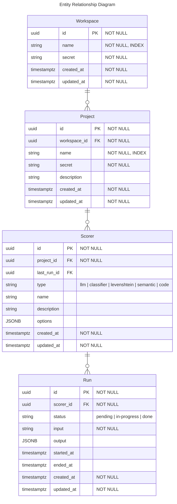

# SigMod: Storage

## Entity

```mermaid
---
title: "Entity Relationship Diagram"
---

erDiagram
    Workspace {
        uuid        id          PK  "NOT NULL"
        string      name            "NOT NULL, INDEX"
        string      secret          "NOT NULL"
        timestamptz created_at      "NOT NULL"
        timestamptz updated_at      "NOT NULL"
    }

    Project {
        uuid        id                PK  "NOT NULL"
        uuid        workspace_id      FK  "NOT NULL"
        string      name                  "NOT NULL, INDEX"
        string      secret                "NOT NULL"
        string      description
        timestamptz created_at            "NOT NULL"
        timestamptz updated_at            "NOT NULL"
    }

    Scorer {
        uuid        id                PK  "NOT NULL"
        uuid        project_id        FK  "NOT NULL"
        uuid        last_run_id       FK
        string      type                  "llm | classifier | levenshtein | semantic | code"
        string      name
        string      description
        JSONB       options
        timestamptz created_at            "NOT NULL"
        timestamptz updated_at            "NOT NULL"
    }

    Run {
        uuid        id                PK  "NOT NULL"
        uuid        scorer_id         FK  "NOT NULL"
        string      status                "pending | in-progress | done"
        string      input                 "NOT NULL"
        JSONB       output
        timestamptz started_at
        timestamptz ended_at
        timestamptz created_at            "NOT NULL"
        timestamptz updated_at            "NOT NULL"
    }

    Workspace ||--o{ Project : ""
    Project   ||--o{ Scorer : ""
    Scorer    ||--o{ Run : ""
```
